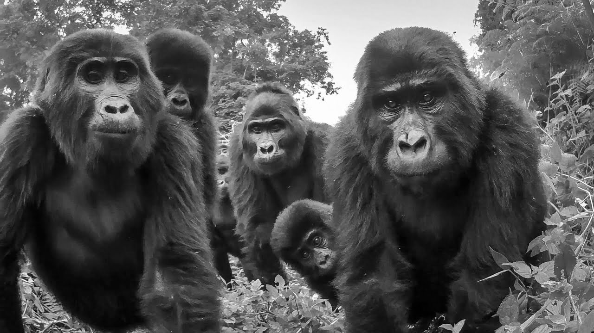

Some iterations have natural drama, surprises or tension to mine, while others are dull by comparison. Even the most dedicated and high-performing teams can struggle to rise to the occasion on their 89th retro together. Managers are not immune.

We have experimented with frameworks yet found **themes** to be a favoured catalyst for creativity.  The light constraint offers a lens through which to view the past and focus the mind, while sparking creative juices.  

**Choose a theme.** We found ourselves overthinking which theme to opt for or gravitating to themes that were *good but dull*, like `quality` or `flow` or `value`. 

**Provide a spark.** Instead, we placed ourselves at the hands of a online random word generator, trusting in our own creativity to honour the retro. Each member generated a word, shared it with the team and voted on their favourite.

**Take an action.** With our chosen theme in mind and all that one might associate with it, we looked at what we could continue, stop and start, before agreeing on an improvement to our current ways of working.

How do you do yours?

---

**Gorilla Retro?** The word `Gorilla` was first random word generated by a team member. FWIW The team opted for an alternate theme on that occasion.

**Random Words.** We chose this online [random work generator](https://randomwordgenerator.com/). 